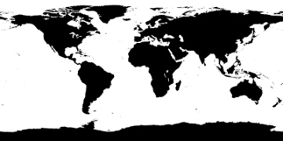

# 3D Animated Globe

An interactive 3D globe built with React Three Fiber and Next.js. It renders land masses as twinkling dots and animates trade routes as arcs and paths between cities around the world.



## Features

- **Dot-rendered land masses** — land areas are drawn as thousands of individually twinkling point instances, derived from a world map image
- **Animated arcs** — great-circle arcs between cities, with animated reveal/hide using draw range on tube geometry
- **Animated paths** — multi-waypoint ocean/shipping routes rendered as Catmull-Rom splines on the sphere surface
- **Target markers** — origin and destination markers appear as the routes animate
- **Orbit controls** — drag to rotate, scroll to zoom
- **Auto-rotation** — the globe slowly rotates, interruptible by the user

## Tech Stack

- [Next.js 15](https://nextjs.org/) (App Router)
- [React Three Fiber](https://docs.pmnd.rs/react-three-fiber) — React renderer for Three.js
- [@react-three/drei](https://github.com/pmndrs/drei) — helpers (OrbitControls)
- [Three.js](https://threejs.org/)
- TypeScript + Tailwind CSS

## Getting Started

```bash
npm install
npm run dev
```

Open [http://localhost:3008](http://localhost:3008).

## Project Structure

```
app/
  page.tsx          — entry point, renders <Scene>
  layout.tsx        — root layout and metadata
  globals.css       — background colour

components/
  scene/            — Canvas setup and route data
    index.tsx       — R3F Canvas with camera config
    air-animations.ts   — arc routes (flight paths)
    ocean-animations.ts — path routes (shipping lanes)

  rotating-globe/   — auto-rotation + lighting + OrbitControls
  globe/            — main globe composition
    index.tsx       — sphere mesh + dots + animation groups
    animation-group/ — timing loop that activates routes on delay
    arc/            — animated great-circle arc (reveal → pause → hide)
    path/           — animated multi-waypoint path (Catmull-Rom spline)
    dots/           — instanced twinkling land-mass dots (custom shader)
    dots-alt/       — alternative dot implementation (Fibonacci sphere)
    target-marker/  — origin/destination ring marker

lib/
  types/            — shared TypeScript interfaces
  utils/
    map.ts          — lat/lon ↔ 3D conversion, land visibility check
    load-image.ts   — loads an image into ImageData via canvas
    classes/
      arc.class.ts  — CubicBezier curve for arcs
      path.class.ts — Catmull-Rom spline curve for paths

public/
  world_alpha_mini.jpg — low-res world map used to detect land pixels
```

## Adding Routes

Routes are defined in `components/scene/air-animations.ts` (arcs) and `components/scene/ocean-animations.ts` (paths). Each entry follows `GlobeRouteAnimation`:

```ts
interface GlobeRouteAnimation {
  id: number;       // unique within the animation group
  type: "arc" | "path";
  path: [number, number][]; // [lat, lon] pairs — two for arc, many for path
  delay: number;    // ms before this route starts animating
  duration: number; // ms for the full reveal + pause + hide cycle
}
```

**Arc example** (two points, flies above the surface):
```ts
{
  id: 1,
  type: "arc",
  path: [
    [40.7128, -74.006],   // New York
    [48.8566,   2.3522],  // Paris
  ],
  delay: 0,
  duration: 3500,
}
```

**Path example** (many waypoints, hugs the sphere surface):
```ts
{
  id: 1,
  type: "path",
  path: [
    [29.4, -94.5],  // Houston
    [28.8, -89.4],
    // ... intermediate waypoints ...
    [53.5,   9.9],  // Hamburg
  ],
  delay: 0,
  duration: 6500,
}
```

Multiple independent animation groups can run in parallel — pass them as separate arrays to `RotatingGlobe`:

```tsx
<RotatingGlobe routes={[airRoutes, oceanRoutes]} rotationSpeed={0.0012} />
```

Each group cycles independently through its own timing sequence.

## Customisation

| Prop | Component | Default | Effect |
|------|-----------|---------|--------|
| `rotationSpeed` | `RotatingGlobe` | `0.002` | Globe auto-rotation speed |
| `sphereSize` | `Globe` | `19` | Radius of the sphere |
| `dotDensity` | `Globe` | `3` | Dot density per degree of latitude |
| `tilt` | `Globe` | `0.55` | Axial tilt in radians |
| `arcHeightFactor` | `Arc` | `0.3` | How high arcs fly above the surface |
| `pathColor` | `Arc` / `Path` | `0x84b845` / `0x2196f3` | Route colour |
| `pathWidth` | `Arc` / `Path` | `0.03` | Tube radius |

## How Land Detection Works

On mount, `Dots` loads `public/world_alpha_mini.jpg` onto an off-screen canvas, reads the pixel data, and records which longitude values are dark (land) for each latitude row. When generating dot positions, it uses a binary search on those recorded values to skip ocean coordinates — so only land-mass dots are rendered.

## License

MIT
